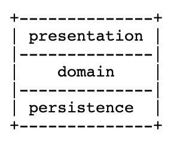
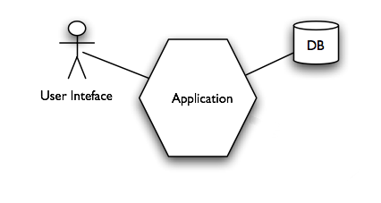
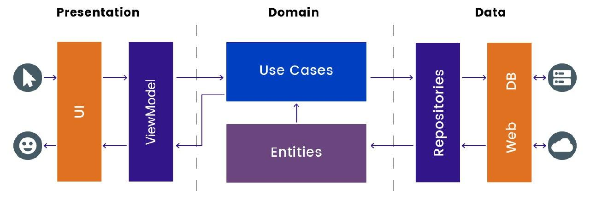

# android-test-2.0

## Features
* Kotlin Gradle DSL for Dependency Management

**Task 1:**
* Hexagonal architecture and TDD
* Clean code following SOLID principle
* Kotest (Kotlin test framework)

**Task 2:**
* Clean Architecture with MVVM and Repository Pattern
* Kotlin Coroutines with Flow
* Dagger Hilt

## Table of content
- [Prerequisite](#Prerequisite)
- [Architecture](#Architecture)
- [Testing](#Testing)
- [Libraries](#Libraries)
- [Extras](#Extras)

## Prerequisite

- Android Studio - Arctic Fox | 2020.3.1 Patch 2 or higher
- Gradle 7.0.2
- [Kotest](https://github.com/kotest/kotest-intellij-plugin) plugin installation in Android Studio

*[May need to sync the project with the Gradle file after checkout the dev branch]*

## Architecture

**Task 1:** Menu Code Kata

In this task, I have followed **Hexagonal architecture** (conceptually equal with clean architecture) and the **TDD** (Test-driven development) way to design a simple implementation of the Menu Feature.

The main goal was to come up with a solution that is:

* **Testable**: We should be able to test the internal application logic (Recipe selection, unselection and others) with no need to query in real Database or API calls.
* **Flexible**: We anticipate that the data source (Available recipes in menu and others) in the future could come from a database, or perhaps a web service.
* **Well-designed**: Separate the business logic from the infrastructure.

The traditional way to structure an application in layers is:

||
|:----:|

The meaning of this layer diagram is that:
A class cannot reference classes in layers above, a class can only reference other classes in the same layer or the lower layers.

Since we have no UI and Database for this task, It makes it difficult to test domain logic without involving the database and it makes it difficult to write unit tests for the domain logic.

||
|:----:|

But Hexagonal architecture makes the domain model independent from low-level concerns such as databases, network services, GUIs and other things “external” to the core of the application. It is closely related to the Dependency Inversion principle.

**Task 2:** Recipes List View

In `task 2`, The application follows **Clean Architecture** and uses **MVVM** Architecture (In presentation layer) and Kotlin along with the Repository pattern to provide clean and scalable development. The main benefits of using Clean Architecture are decoupled code and easier to reuse, maintain and test code. It also maximizes the use of **SOLID** principles.

##### Why MVVM ?

There are a few well-known architectural patterns (MVC, MVP, MVVM, MVI) used in the Android community. Any design pattern can be used. But we will have to choose the one which meets our requirements.

In **MVC**, the Controller is tied so tightly to the Android APIs that it is difficult to unit test also it is tightly coupled to the views.

**MVI** could be used here but it introduces complexity to both create and maintain. It also generates more boilerplate code than **MVVM** and **MVP**.

**MVP** was our go-to solution for a long time, for separating UI code from the rest of the app. We can combine Clean Architecture with the **MVP** architecture as well. But since Android Architecture Components already provides a built-in ViewModel class and this is a small project for that I have gone with **MVVM** over **MVP**.

##### Modules
In `task 2` module, layers are divided into different Gradle modules namely:
- __Presentation (Default Layer)__:  Layer with the Android Framework, the MVVM pattern and the DI module. Depends on the domain to access the use cases and on DI, to inject dependencies.
- __Domain__: Layer with business logic. Contains domain model classes that represent the data we will be handling across presentation and data layer.
- __Data__: Layer with the responsibility of providing data for the domain layer. It contains the implementations of the repositories declared in the domain layer.

||
|:----:|

##### Presentation
In `task 2` module the default layer contains the UI file  `RecipesListActivity` and `RecipesListViewModel` which control the views. `RecipesListActivity` communicates with `RecipesListViewModel` to request data and observe the `RecipesListViewModel`, using live data components and reacting to its changes. `RecipesListViewModel` communicates with the domain layer and invokes Use-case, collects data and updates live data.

Dependency Injection is also implemented here which provides proper objects and injects them to desired dependencies.

##### Domain
Business logic can be defined as the core operations done by the application. The `domain` module contains the app business logic. The components of the domain are Entity, Repository and Use-case.
`Recipe` Entity is the data class that represent the objects on which the business is based.
`RecipeRepository` is a interface used by the `GetRecipesListUseCase` and implemented in the data layer.
`GetRecipesListUseCase` that represent a single unit of business logic, use the `RecipeRepository` to resolve the action they are supposed to do.
##### Data
The `data` module is the implementation of the `RecipeRepository` declared by the domain layer. It handles data interacting with the network and is later served up to the presentation layer. This module uses the Retrofit library to fetch data from the [Recipe API](https://hf-android-app.s3-eu-west-1.amazonaws.com/android-test/recipes.json).

## Testing

In `task 1` module, For testing and making assertions I have used `kotest` which is a powerful, elegant and flexible test framework for Kotlin. `Kotest` offers several different styles to write tests. I have chosen the `StringSpec` style for writing human-readable unit-tests and `AnnotationSpec` for integration tests.

Unit-testing has been done following the TDD way. TDD has been used for better program design and getting a reliable solution and by using this I addressed issues of testability early.

`kotest` has been used in `AppIntegrationTest` also and to test the data flow and interaction between all classes I integrated all the service classes there.

The test uses fake objects for all the tests instead of mocks because it makes it easier to verify interactions between objects and simulate the behavior of the real objects.

## Libraries
The app is built upon the following libraries :
- [ViewModel](https://developer.android.com/topic/libraries/architecture/viewmodel) - Manage UI-related data in a lifecycle conscious way and act as a channel between use cases and UI.
- [View Binding](https://developer.android.com/topic/libraries/view-binding) - Allows to more easily write code that interacts with views.
- [Retrofit](https://square.github.io/retrofit/) - Type-safe HTTP client for Android.
- [Moshi](https://github.com/square/moshi) - A modern JSON library, used to parse requests on the data layer for Entities and understands Kotlin non-nullable and default parameters.
- [Dagger Hilt](https://dagger.dev/hilt) - Handles dependency injection.
- [okhttp-logging-interceptor](https://github.com/square/okhttp/blob/master/okhttp-logging-interceptor/README.md) - Logs HTTP request and response data.
- [kotlinx.coroutines](https://github.com/Kotlin/kotlinx.coroutines) - Library Support for coroutines helps to manage long-running and asynchronous tasks.
- [Material Design](https://material.io/develop/android/docs/getting-started/) - Build awesome beautiful UIs.
- [Glide](https://github.com/bumptech/glide) - Fast and efficient image loading framework.
- [Kotest](https://github.com/kotest/kotest) - Flexible and comprehensive testing tool for Kotlin with multiplatform support.
- [Kotlin Gradle DSL](https://guides.gradle.org/migrating-build-logic-from-groovy-to-kotlin)

## Extras
The Gradle script uses Kotlin Gradle DSL for dependency management, code suggestion support and code navigation which helps to save time. This approach is easy for better reusability and easy maintenance.

